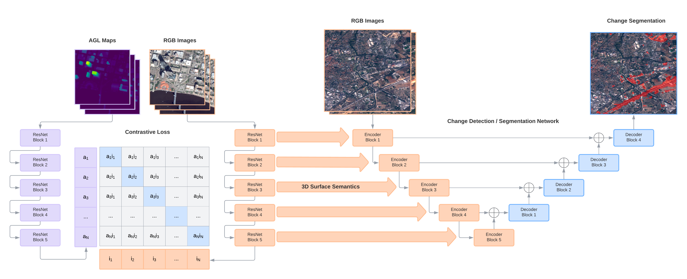

# Contrastive Surface Image Pretraining (CSIP)

</img>

This repository contains code for the paper ["Supervising Remote Sensing Change Detection Models with 3D Surface Semantics", Corley et al. (2022)](https://arxiv.org/abs/2202.13251). In this paper we contrastively train dual encoders (RGB and AGL) to learn 3D surface semantics. We then evaluate the pretrained RGB encoder on several downstream change detection and segmentation tasks. We find that pretraining using our CSIP framework improves performance on downstream tasks where surface and height information is relevant in optical imagery.

</img>

## Install dependencies

First install OpenJPEG to read JPEG2000 (.j2k) files

```bash
sudo apt-get install -y libopenjp2-7 libopenjp2-7-dev
```

Install Python dependencies

```bash
pip install -r requirements.txt
```

## Datasets

- The Overhead Geopose dataset can be downloaded [here](https://ieee-dataport.org/open-access/urban-semantic-3d-dataset)
- The OSCD dataset can be downloaded [here](https://rcdaudt.github.io/oscd/)
- The xBD dataset can be downloaded [here](https://xview2.org/dataset)
- The S2Looking dataset can be downloaded [here](https://github.com/S2Looking/Dataset)
- The LandCover.ai dataset can be downloaded [here](https://landcover.ai/)

## Pretraining

```bash
python pretrain.py --cfg conf/pretrain_overhead_geopose.yaml
```

## Training

To perform an individual experiment, use the following:

```bash
python train.py --cfg conf/oscd-csip.yaml
```

To repeat all experiments from the paper, use the following:

```bash
bash train.sh
```

## Evaluation

To evaluate an individual experiment, use the following:

```bash
python evaluate.py --dir logs/oscd-csip
```

To evaluate all experiments from the paper, use the following:

```bash
bash evaluate.sh
```
